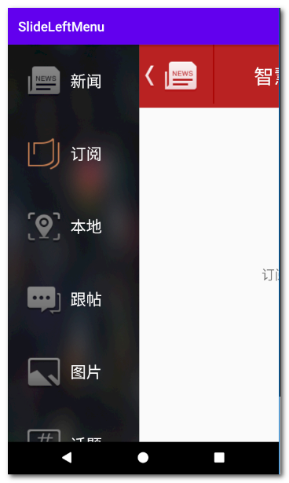

# SlideLeftMenu
左滑菜单

How to
To get a Git project into your build:

Step 1. Add the JitPack repository to your build file

Add it in your root build.gradle at the end of repositories:

	allprojects {
		repositories {
			...
			maven { url 'https://jitpack.io' }
		}
	}

Step 2. Add the dependency

	dependencies {
	        implementation 'com.github.kuang2010:SlideLeftMenu:1.0.0'
	}

Step3. use in xml layout:

    <com.kuang2010.slidemenuview.SlideMenuView
        android:id="@+id/smv_home"
        android:layout_width="match_parent"
        android:layout_height="match_parent">
        <include layout="@layout/main_content"/>
        <include layout="@layout/left_menu"/>
    </com.kuang2010.slidemenuview.SlideMenuView>

